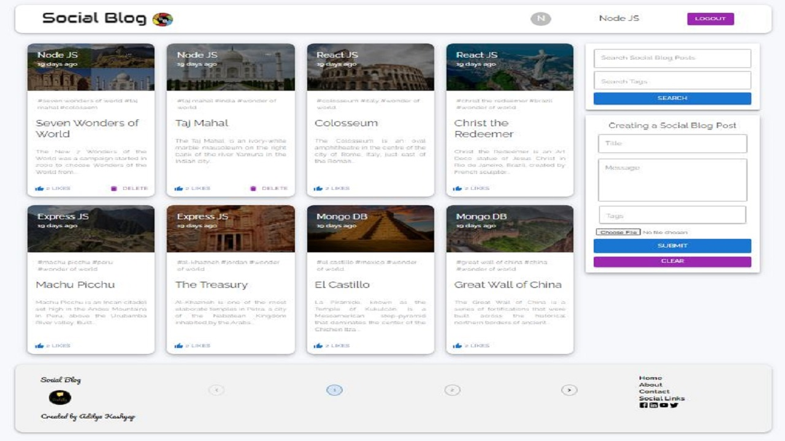

# Social Blog

In this project (Social Blog) I'm developing a website like simple social media, where peoples can share their memories or daily life experience and topics that interest them, usually with photographs they find interesting. This is a project based on MERN stack.

This Social Blog project made with MERN (MongoDB, ExpressJS, ReactJS, NodeJS) stack. 

In this project for deployment of the project I'm using Azure Cosmos DB, Azure App Service (Web App) and Visual Studio Code for development and deployment.

To Start this project => **npm install && npm start**

Project Video Demo Link: 

Link to website: https://socialmediablog.netlify.app/

Alternate Link to website: https://socialblog.azurewebsites.net/

Video Demo Link: 

Snapshot of Website:

